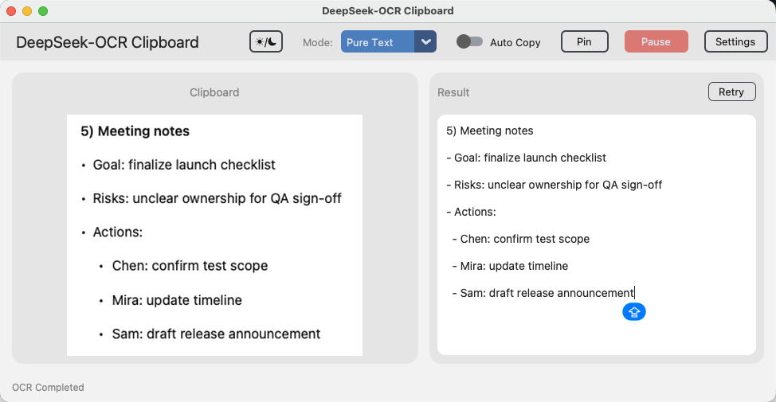

# DeepSeek-OCR Clipboard

一个现代、无边框且高效的桌面应用程序，可自动监控剪贴板中的图像，并使用 DeepSeek-OCR API 进行 OCR 识别。

基于 Python 和 CustomTkinter 构建，呈现时尚的暗色模式 UI。



## 功能特点

- **自动检测**：即时检测复制到剪贴板的新图像。
- **高精度 OCR**：利用 DeepSeek 的多模态 LLM 能力进行精准的文本提取。
- **多种模式**：
    - **纯文本**：只提取文字。
    - **Markdown**：保留文档结构和格式。
    - **图表分析**：解析图片中的图表内容。
- **现代 UI**：基于 CustomTkinter 的无边框暗色主题设计。
- **自动复制**：提供开关，识别完成后自动将结果复制到剪贴板。
- **置顶模式**：支持窗口置顶，方便对照查看。
- **隐私且安全**：不仅本地运行（不存图），还已将敏感配置从 git 中忽略。

### ⚠️ 隐私警告

**请务必注意**：在处理敏感信息（如密码、个人数据、机密文件）时，请勿启用此程序。
* 剪贴板中的所有图片都会被自动上传至 API 提供商 (SiliconFlow) 进行处理。
* 请确保您信任该 API 提供商，并谨慎处理敏感数据。

## 前置要求

- Python 3.8+
- [SiliconFlow](https://siliconflow.cn) 的 API Key (模型: `deepseek-ai/DeepSeek-OCR` 或兼容模型)

## 安装指南

1. 克隆仓库：
   ```bash
   git clone https://github.com/yourusername/DeepSeek-OCR-Clipboard.git
   cd DeepSeek-OCR-Clipboard
   ```

2. 安装依赖：
   ```bash
   pip install -r requirements.txt
   ```
   *(注意：如果缺少 `requirements.txt`，请手动安装: `pip install requests pillow customtkinter`)*

## 使用说明

1. 启动应用：
   ```bash
   python main.py
   ```

2. **配置**：
   - 点击右上角的 **Settings (设置)** 按钮。
   - 输入您的 **API Key** (API URL 和模型默认已填好)。
   - 点击 **Save (保存)**。
   - **提示**：您也可以点击 "获取 Key" 按钮跳转到 SiliconFlow 控制台。

3. **使用环境变量** (可选)：
   您可以在启动应用前设置环境变量 `DEEPSEEK_API_KEY`，应用将自动读取该变量作为 API Key。
   ```bash
   export DEEPSEEK_API_KEY="sk-..."
   python main.py
   ```

4. **开始 OCR**：
   - 使用截图工具 (如 Cmd+Shift+4) 或复制网页图片。
   - 应用会自动显示预览并开始识别。
   - 可以在顶部工具栏切换 **Mode (模式)** 来获得不同的输出格式。

## 配置文件

应用程序会在根目录生成 `config.cfg` 文件。此文件包含您的 API 凭据。
**注意**：`config.cfg` 已被加入 `.gitignore`，以保护您的 API 密钥不被泄露。

## 开发相关

- **`main.py`**: UI 入口和主要逻辑。
- **`ocr_engine.py`**: 处理 API 通信和图像预处理。
- **`clipboard_monitor.py`**: 后台线程，轮询剪贴板变化。
- **`config_manager.py`**: 简单的 JSON 配置加载器。

## 许可证

[MIT License](LICENSE)
